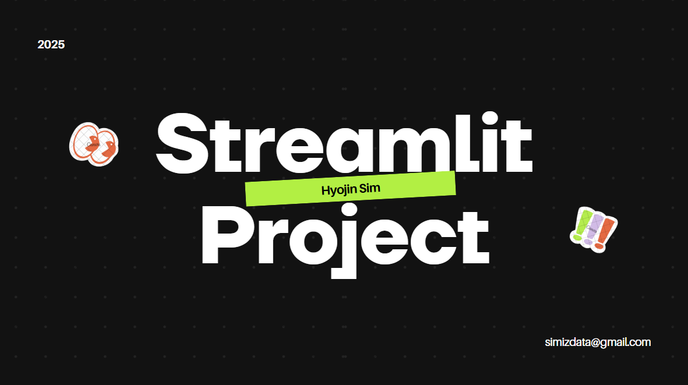

## Hyojin Sim

안녕하세요, 고객 니즈 맞춤형 전략으로 성과를 달성해 온 마케터 심효진입니다. 
퍼포먼스 마케팅 경험을 통해 데이터 툴 활용 능력과 분석 역량을, 
패션 브랜드 이커머스 운영 경험을 통해 프로세스 효율 개선 및 협업 역량을 쌓아왔습니다.

## 1. 상품 리뷰 분석 시스템 구현: 네이버 블로그 크롤링을 통한 긍/부정 리뷰 분석

  
* 주요 기능: 특정 상품 검색 시, 네이버 블로그 게시글을 크롤링하여 해당 리뷰 데이터에서 긍정, 부정 반응을 분석
* 기대 효과: 광고 콘텐츠 게시 가능한 환경 구현 > 콘텐츠 수익화 가능
