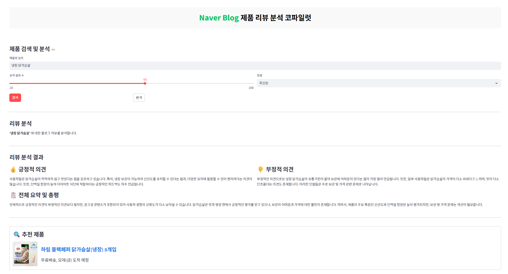
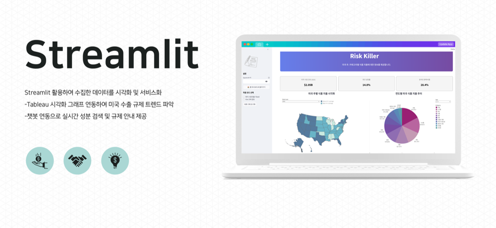

## 1. 상품 리뷰 분석 시스템 구현: 네이버 블로그 크롤링을 통한 긍/부정 리뷰 분석

  
* 주요 기능: 특정 상품 검색 시, 네이버 블로그 게시글을 크롤링하여 해당 리뷰 데이터에서 긍정, 부정 반응을 분석
* 기대 효과: 광고 콘텐츠 게시 가능한 환경 구현 > 콘텐츠 수익화 가능
 
 

## 2. 미국 식품 수출을 준비하는 K-푸드 기업을 위한, FDA 규제 맞춤형 챗봇 도우미
 

  
**주요 기능**
 
(1) 현지 시장 분석  
-2025 미국 식료품 시장 규모  
-카테고리별 매출 추이 파악  
-리콜 사례 기반으로 리스크 확인  
(2) 규제 리스크 검토 챗봇  
-수출 시 예상되는 리스크 사전 검토  
-FDA 규제 업데이트  
-리콜 사례 업데이트  
  
**기대 효과**
 
-상품 기획 단계에서 리스크 사전 관리   
-수출 프로세스 효율화   
-상품 현지화 전략 고도화  
  
**보완점**
  
-FDA(Food and Drug Administration) 데이터 중 의약품 데이터는 조회 불가   
-상품 기획 초기 및 수출 준비 단계에서 활용 가능한 서비스로,   
수출 심사 과정 전반을 대체하기는 어려움  
-수출 과정 중 발생한 예외 상황(유해 요인으로 심사 거절 등) 대응에는  한계
